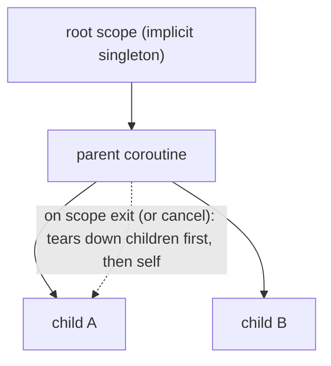

# @arche/concurrency

A lightweight, **non-viral**, structured-concurrency library for TypeScript. It gives you cancellable coroutines, ambient scopes with guaranteed cleanup, and Go-style concurrency primitives (channel, mutex, semaphore, waitgroup, future) — without the "everything must be wrapped" contagion of Effect.

Targets: Node, Bun, and Cloudflare Workers/Durable Objects (`workerd`). **No browser** (the ambient-scope mechanism relies on `AsyncLocalStorage`).

## Goals

- Run coroutines, await them, cancel them, with **scope semantics** so a child's lifetime never outlives its parent.
- Abstract away `AbortSignal` for the common case, but still expose it (`ctx.signal`) for raw interop.
- Stay non-viral: a coroutine result is an ordinary awaitable; you can cross in and out of "io-land" freely.
- Provide the concurrent data structures real agent loops need.

## Non-goals (for now)

Browser support, pub/sub broadcast, a structured nursery/group object, Go-style context values, `io.any`, absolute-time deadlines. See [Open TODOs](#open-todos).

## Mental model: `Coroutine` (spec) vs `RoutineHandle` (run)

The central split mirrors Python's `coroutine` vs `Task`:

- `io.coroutine(fn)` returns an **inert, one-shot, non-thenable** `Coroutine<T>`. Creating it runs nothing.
- `coro.spawn()` starts it **once** and returns a `RoutineHandle<T>`. A second `spawn()` throws `CoroutineAlreadyStartedError`.
- The `RoutineHandle` is the running instance: it is `await`-able and carries `cancel()` / `cancelGracefully()` / `cancelled`. Its result is **memoized** (await it as many times as you like).

Because the spec is not thenable, dropping it into `Promise.all`/`Promise.resolve`/`return` cannot accidentally start it. To reuse a body, use a **factory**:

```ts
const job = () =>
  io.coroutine(async () => {
    /* ... */
  });
io.all([job(), job(), job()]); // three fresh one-shot coroutines
```

## Scope & ambient context

Each coroutine **is** a scope. Scope is propagated implicitly through `AsyncLocalStorage`:

- A coroutine's **parent** is whatever coroutine is ambient at `spawn()` time.
- Spawning with no ambient coroutine attaches to an **implicit singleton root scope** (never auto-cancels).
- Framework operations (`io.sleep`, channel ops, `mutex.acquire`, awaiting a child) read the ambient scope to wire cancellation — that's why they don't take a `signal` argument.



## Cancellation (flows down the tree)

Every coroutine owns an internal `AbortSignal` and listens to it. On cancel, teardown is **ordered**:

1. Recursively cancel all child coroutines (leaf-first).
2. Run this coroutine's `defer`s, **LIFO**.
3. Settle the handle as `CancelledError`.

Cancellation is **injection at framework await points**: the in-flight framework await (`io.sleep`, `chan.receive`, ...) throws `CancelledError`, the body unwinds through `try/finally` + `defer`. JS cannot interrupt a raw `await somePromise()` or a tight sync loop, so for those you cooperate via `ctx.signal` / `ctx.throwIfCancelled()`, or thread `ctx.signal` into the raw call (`fetch(url, { signal: ctx.signal })`).

**Idempotent.** Cancellation routinely arrives from several sources at once (parent teardown, `io.withTimeout`, `io.all` fail-fast, a user handle). An internal flag guarantees the teardown sequence runs **exactly once**; later `cancel()` calls are no-ops, and `cancelGracefully()` just awaits the in-flight teardown. (`spawn` is one-shot/throws; `cancel` converges/no-ops — they are deliberately asymmetric.)

### Two timeouts

Both default to **5000ms**, set at init and overridable per `spawn({ cancelTimeout, deferTimeout })` / `cancelGracefully({ ... })`:

- **cancel timeout** — budget for the body to actually halt after cancellation is requested. If a body is wedged on a never-resolving raw promise it cannot unwind, it is moved to a **zombie zone**, a `"coroutine hung"` warning is logged, and the handle settles as `CancelledError` anyway (callers are never blocked forever).
- **defer timeout** — a **total** budget for the whole LIFO `defer` chain. When it elapses, the cleanup signal aborts, remaining defers are skipped, and a warning is logged.

`cancel()` is fire-and-forget (kicks off teardown, returns); `cancelGracefully()` awaits it.

## Strict structured concurrency (a child cannot outlive its parent)

We adopt **strict** structured concurrency (à la [Effection](https://frontside.com/effection/blog/2026-04-07-strict-structured-concurrency/)): not only does a parent wait for its children, but **any still-running child is automatically torn down when its parent's scope exits** — whether the parent completed normally, threw, or was cancelled. There is no "teardown tax": you never have to manually halt a fire-and-forget child.

Each scope tracks the coroutines spawned within it. When the body settles, teardown runs in order:

1. **Tear down still-running children** — `cancelGracefully()` each and await them. This recurses, so grandchildren tear down first (leaf-first). Children that were `await`ed have already settled and removed themselves, so this only affects background / spawn-and-forget children.
2. Run this scope's `defer`s, **LIFO**.
3. Settle the handle.

This means a background task started with a bare `.spawn()` (or `io.background([...])`) is guaranteed to be cancelled — **and have its `defer`s run and awaited** — before its parent settles:

```ts
await io
  .coroutine(async () => {
    io.coroutine(async () => {
      defer(async () => {
        await flush();
      }); // still runs, still awaited
      while (true) await io.sleep(100); // infinite background work
    }).spawn();
    return computeResult();
    // <- scope exits: the background child is cancelled, its defer flushed,
    //    THEN this coroutine settles with computeResult().
  })
  .spawn();
```

**Bounded.** Strict teardown can never hang the parent: each child's `cancelGracefully()` is bounded by that child's own cancel timeout (a wedged child is reaped as a zombie with a `"coroutine hung"` warning).

**Strict teardown, not strict fault propagation.** Unlike Effection, a background child that _throws_ still does **not** blow up the parent — see [Errors](#errors-do-not-flow-up-the-tree). We take the auto-teardown guarantee but keep the non-viral error model.

## `defer` — cleanup that actually runs

`defer` is a **global function** (not `ctx.defer`); it uses ALS to attach the cleanup to the current ambient coroutine. Its callback receives **its own `ctx`**, so cleanup is itself a scoped unit:

```ts
io.coroutine(async () => {
  const ws = await connect();
  defer((ctx) => ws.close()); // ctx.signal here is the live cleanup signal
  // ...
});
```

- Defers may be async and are **awaited sequentially, LIFO**.
- Defers run **shielded**: during teardown the parent signal is already aborted, so each defer runs under a **fresh, non-aborted cleanup `ctx.signal`** (bounded by the defer timeout). This is what lets `await ws.close()` / `await flush()` actually complete.

## Errors (do not flow up the tree)

There is **no upward fault propagation** (this is the non-viral choice, not Trio nursery semantics):

- A throwing coroutine settles its handle **rejected**.
- If the handle is **observed** (awaited / `.then` / `.catch`), the awaiter receives the error. `io.all` / `io.race` / `io.allSettled` observe their members internally, so their fail-fast / aggregate behavior is unchanged.
- If the handle is **never observed** (typical `io.background` / spawn-and-forget), the framework logs `"unhandled coroutine error: ..."` (modeled on Node's unhandled-rejection detection). Starting work in the background means "I don't care about the result," but the error is never silently lost from the logs.
- `CancelledError` is **never** logged-as-unhandled or treated as a fault.

### Error catalog

```ts
class ConcurrencyError extends Error {
  readonly code: string;
}

class CancelledError extends ConcurrencyError {
  code = "cancelled";
}
class TimeoutError extends ConcurrencyError {
  code = "timeout";
}
class CoroutineAlreadyStartedError extends ConcurrencyError {
  code = "already_started";
}
class ChannelClosedError extends ConcurrencyError {
  code = "channel_closed";
}
class WaitGroupError extends ConcurrencyError {
  code = "waitgroup";
}
```

Each carries a literal `code` so callers can use both `instanceof` and an exhaustive `switch (err.code)`.

## `ctx`

The object passed to a coroutine body (and to a `defer` callback) is deliberately thin:

```ts
interface Ctx {
  readonly signal: AbortSignal; // thread into fetch/raw async; manual checks
  readonly cancelled: boolean; // === signal.aborted
  throwIfCancelled(): void; // cooperative checkpoint -> throws CancelledError
  readonly name?: string; // optional label for diagnostics (zombie/unhandled logs)
}
```

Spawning children is **not** on `ctx` — you call the ambient `io.coroutine(...).spawn()` / `io.background(...)`, and ALS wires the parent.

## API reference (single `io.`\* namespace)

```ts
// --- lifecycle ---
io.coroutine<T>(fn: (ctx: Ctx) => Promise<T>): Coroutine<T>;
coro.spawn(opts?: { cancelTimeout?: number; deferTimeout?: number }): RoutineHandle<T>;
io.background<T>(coros: Coroutine<T>[]): RoutineHandle<T[]>; // spawn many, don't await for results
io.sleep(ms: number): Promise<void>;                        // plain thenable, cancelled via ambient scope
defer(fn: (ctx: Ctx) => void | Promise<void>): void;        // global; LIFO; shielded

interface Coroutine<T> { spawn(opts?): RoutineHandle<T> }    // inert, one-shot, NOT thenable
interface RoutineHandle<T> extends PromiseLike<T> {
  cancel(): void;
  cancelGracefully(opts?: { timeoutMs?: number }): Promise<void>;
  readonly cancelled: boolean;
}

// --- combinators (return RoutineHandle, consume inert coroutines, fail-fast) ---
io.all<T>(coros: Coroutine<T>[]): RoutineHandle<T[]>;
io.race<T>(coros: Coroutine<T>[]): RoutineHandle<T>;
io.allSettled<T>(coros: Coroutine<T>[]): RoutineHandle<SettledResult<T>[]>;
io.withTimeout<T>(ms: number, coro: Coroutine<T>): RoutineHandle<T>;   // rejects TimeoutError on deadline
io.withRetry<T>(factory: () => Coroutine<T>, opts?: RetryOptions): RoutineHandle<T>; // never retries CancelledError

// --- data structures ---
io.future<T>(): Future<T>;            // resolve()/reject(), write-once, silent no-op on double-settle
io.mutex(): Mutex;                    // acquire() -> release token; runExclusive(fn); FIFO; cancellable
io.semaphore(n: number): Semaphore;   // mutex === semaphore(1)
io.channel<T>(opts?: { capacity?: number }): Channel<T>; // capacity 0 = rendezvous; competing-consumer
io.waitGroup(): WaitGroup;            // Go-style add/done/wait; negative throws WaitGroupError

// --- shutdown ---
io.cancelGlobal(): void;
io.cancelGlobalGracefully(opts?: { timeoutMs?: number }): Promise<void>;
```

### `io.withRetry` options

```ts
interface RetryOptions {
  maxAttempts?: number; // default 3
  backoff?: "exponential" | "linear" | "constant"; // default "exponential"
  baseDelayMs?: number; // default 100
  maxDelayMs?: number; // default 30_000
  jitter?: boolean; // default true (full jitter)
  shouldRetry?: (err: unknown, attempt: number) => boolean; // default: any non-cancel error
  onRetry?: (err: unknown, attempt: number, delayMs: number) => void;
}
```

### Worked examples

Resource cleanup with `defer` and a `future`:

```ts
const connectWs = (url: string) =>
  io.coroutine<string>(async () => {
    const ws = await rawConnect(url);
    const result = io.future<string>();
    defer(() => ws.close()); // runs LIFO on completion or cancel
    ws.on("error", (e) => result.reject(e));
    ws.on("close", () => result.resolve("done")); // no-op if already settled
    return await result; // plain thenable, cancelled via ambient scope
  });
```

Producer/consumer with a channel + waitgroup (competing consumers):

```ts
io.coroutine(async () => {
  const chan = io.channel<number>({ capacity: 10 });
  const wg = io.waitGroup();

  const producer = io.coroutine(async () => {
    for (let i = 0; i < 100; i++) {
      wg.add(1);
      await chan.send(i);
    }
    chan.close();
  });

  const consumer = () =>
    io.coroutine(async () => {
      for await (const v of chan) {
        handle(v);
        wg.done();
      } // ends cleanly on close
    });

  io.background([producer, consumer(), consumer(), consumer()]); // cancelled when this coroutine exits
  await wg.wait();
});
```

## Open TODOs

- **Pub/sub broadcast** primitive (every subscriber sees every value) — `channel` is competing-consumer only.
- **Structured nursery/group** object (`group.spawn` + `group.join`, auto-tracked, auto-cancel on error).
- **Go-style context values** (request-scoped key/value propagation down the tree).
- `**io.any`\** (first to *resolve\*, ignoring rejections) alongside `io.race` (first to settle).
- **Absolute-time deadline** variant of `io.withTimeout`.

## Validation checklist

- [ ] Confirm `AsyncLocalStorage` context survives `await` boundaries in **Bun** (the test runner).
- [ ] Confirm the same in **workerd / Durable Objects**; if ambient propagation is unreliable in a target, fall back to threading scope explicitly.
- [ ] Confirm ALS behaves across dynamic-worker / facet boundaries (relevant to the `apps/durable-objects` plugin host).
